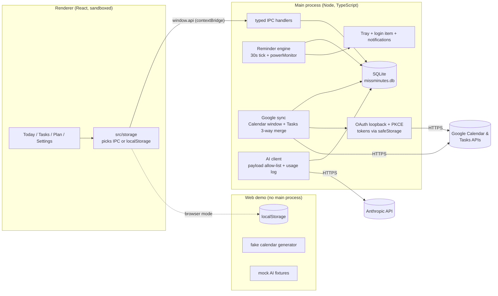

# Miss Minutes: plan

Status: **draft for approval** (2026-10-06). Decisions are referenced as D1, D2, ... (see
DECISIONS.md). Where this plan quotes Google or Anthropic facts, they were checked against the
live docs on 2026-10-06. Re-check them at the milestone that uses them.

---

## 1. Product scope

**The pitch:** one desktop app that knows your tasks *and* your calendar. It reminds you
reliably, even after sleep, puts phone-worthy reminders onto your phone through Google
Calendar, and can optionally turn a typed sentence into a task, split a vague task into steps,
or propose a realistic plan for your day. The AI proposes; nothing changes until you confirm.

### v1 (in scope)
| Area | Feature | Why it is in v1 |
|---|---|---|
| Tasks | title, notes, due date + optional time, P1–P4 priority, project, tags, one level of subtasks, estimate (minutes) | the core of the app (D4) |
| Recurrence | RRULE ("every weekday", "2nd Tue") + "repeat N days after completion" | daily use depends on it |
| Reminders | native notifications 24/7, snooze, catch-up for missed reminders, 📱 mirror to phone | you asked for full-day and phone reminders (D2, D6, D14) |
| Today view | overdue + today's tasks + timed reminders + events from all selected calendars on one timeline, Inbox strip for undated tasks | the screen you open every morning |
| Google Calendar | read several calendars; create/edit events on owned calendars after confirmation | you asked for read/create/edit across calendars (D10–D12) |
| Google Tasks | two-way sync, projects ↔ task lists | you asked for it (D13) |
| AI | natural-language capture, task breakdown, plan my day | your three picks (D3) |
| AI usage | per-feature tokens/cost, optional caps | you asked to see usage (D19) |
| Web demo | fake calendar, mock AI, localStorage | portfolio requirement (D20) |

### Later (out of v1)
| Feature | Why it was cut |
|---|---|
| Q&A / weekly review | your lowest-ranked pick; the financeflow aggregate-tools pattern makes it a cheap post-v1 add |
| CSV / other-app import | Google Tasks sync already imports your existing tasks (D5) |
| Incremental calendar sync (`syncToken`) | windowed refetch is simpler and well within quota at your volume (D11) |
| Editing whole recurring series | single-instance edits cover most uses; editing a series has many edge cases (D12) |
| Native Windows toast buttons (snooze in the toast) | needs custom `toastXml`; clicking the notification to open a popover is enough (D14) |
| Quiet hours, travel mode, multiple time zones | you rarely travel (D6) |
| Phone app / sync backend | the calendar-mirror approach (D2) covers the need |

**Works with AI off:** every AI entry point has a non-AI path. Capture falls back to `chrono-node`,
plan-my-day to a greedy scheduler, and breakdown to "add steps manually". If no API key is set,
the AI buttons are simply hidden.

---

## 2. Architecture

The financeflow stack, with the main process written in TypeScript (D7): Electron, React,
Vite, TypeScript (strict), SQLite (`better-sqlite3`), and a localStorage build for the demo.

### Code layout (planned)
| Path | Contents |
|---|---|
| `src/core/` | pure logic, no I/O: recurrence, time (DST), reminder planner, free-slot finder, greedy planner, plan validator, sync merge. Takes an injected `Clock` |
| `src/storage/` | runtime-selected storage (financeflow pattern) |
| `src/ui/` | React screens and components |
| `electron/` | `main.ts`, `preload.ts`, `db/` (schema + migrations), `reminders/`, `google/` (auth, calendar, tasks), `ai/` (`client.ts`, `payload.ts`, `usage.ts`, `mockServer.ts`) |
| `demo/` | fake-calendar generator, mock AI fixtures |
| `eval/` | `parse/` and `plan/` eval sets, graders, runners, results |
| `test/fakes/` | fake Google server, fake clock |

### Reminders: how they fire reliably (D14, D15)
- **Where the scheduler runs:** in the main process, *not* the renderer, so reminders fire with
  the window closed. Closing the window hides the app to the tray; "Quit" is in the tray menu.
- **Start on login:** the app starts hidden at login (setting, on by default). A single-instance
  lock prevents two schedulers.
- **The tick:** every 30 s, plus immediately on `resume`, `unlock-screen` and app start. Each
  tick fires due reminders in one transaction with a UNIQUE fire log. Firing is idempotent:
  after sleep there are no duplicates, and at most one notification can be lost in a crash.
- **After sleep or app closed:** anything missed by more than 2 minutes is grouped into a single
  "You missed N reminders" notification, shown once.
- **Time zones and DST:**
  - Timed items are stored as wall-clock time plus an IANA zone, or as UTC instants for
    calendar events.
  - Fire times are recomputed when the system zone changes.
  - A spring-forward gap fires the reminder after the gap; a fall-back hour fires it on the
    first occurrence only.
- **📱 reminders:** the same reminder is also written as an event on the "Miss Minutes"
  calendar with a popup override (D8), so the phone alerts even if the PC is off. Moving or
  deleting the reminder updates or deletes the event (idempotent, keyed on `mmId`).

### Security
- **Window security:** `contextIsolation`, `sandbox` and no `nodeIntegration`. The preload
  exposes a narrow, typed `window.api`.
- **Secrets:** the Anthropic key and Google tokens are encrypted with `safeStorage` and held in
  the main process only. They are never sent over IPC and never logged.
- **IPC:** a contract test checks the preload's surface against the handler list (financeflow's
  `ipc-contract.test.ts` pattern).

---

## 3. Google integration

### OAuth (D9)
1. Generate a PKCE `code_verifier`, a random string, and its S256 `code_challenge`.
2. Start an HTTP listener on `127.0.0.1:<random free port>`.
3. Open the system browser at Google's consent URL. Include `redirect_uri`, the challenge,
   `access_type=offline` and a random `state`.
4. The listener receives the code. It checks `state`, exchanges the code plus the verifier for
   tokens, then closes.
5. Tokens are encrypted with `safeStorage`. Access tokens are refreshed shortly before they
   expire.

**Why PKCE:** a desktop app can't keep its client secret secret, because anyone can unpack the
installer. PKCE ties the authorization code to a one-time secret that only this running app
knows, so an intercepted code is useless.

### Gotchas and how we handle them (checked 2026-10-06)
| Gotcha | Handling |
|---|---|
| **"Testing" status:** refresh tokens for Calendar/Tasks scopes expire **7 days** after consent | publish your own client as "In production" (unverified, one-time warning screen; the 100-user lifetime cap doesn't matter for one user) (D9) |
| Calendar/Tasks scopes are likely "sensitive"; Google's docs don't list which | assume sensitive, check the Cloud Console picker in M5; staged consent (D10) |
| At most 100 refresh tokens per account per client; extras silently revoke the oldest | never re-consent if a valid refresh token exists; "Disconnect" revokes the token at Google |
| Quotas: Calendar 600 req/min per user, 10k/min per project (updated 2026-05-01, with a new 1M/day per-project threshold); Tasks 50k/day | polling every 5 min uses a few hundred requests/day; exponential backoff with jitter on 403 `usageLimits`/429 |
| Recurring events and exceptions | `singleEvents=true`: Google expands them; instances carry `recurringEventId` and `originalStartTime` (D11) |
| All-day events: `start.date`/`end.date`, **end exclusive** | stored as local dates; a one-day event has `end = start + 1` |
| Sync tokens can't be combined with `timeMin`/`timeMax`; a 410 means "start over" | not used in v1; documented for the post-v1 upgrade |
| Tasks `due` is **date-only** (the time is discarded); no recurrence field; no sync token; `parent` can't be set directly (it's read-only, so use `move`) | due time, recurrence, priority and tags are local-only; poll with `updatedMin`; set the parent through the insert's `parent` parameter or `tasks.move` (D13) |
| Popup reminders on API-created events reaching the phone: implied by the docs but not stated outright | explicit manual check in M9 before calling 📱 done |

### Demo and test calendars
`demo/fakeCalendar.ts(seed, today)` deterministically generates:
- three calendars;
- weekly recurring meetings, including one cancelled instance and one moved instance;
- all-day and multi-day events;
- overlapping events;
- events that cross midnight;
- a week that contains a DST transition.

The same generator feeds the web demo, the fake Google server (which returns Google-shaped JSON
for the sync tests) and the plan-my-day eval.

---

## 4. AI features (Claude API)

### Ranking and v1 choice (D3)
| Rank | Feature | v1? | Model (D17) | Fallback when AI is off or errors |
|---|---|---|---|---|
| 1 | Natural-language capture | ✅ | Haiku 4.5 | `chrono-node` parser + "title = remaining text" |
| 2 | Task breakdown | ✅ | Haiku 4.5 | manual subtasks; nothing is lost |
| 3 | Plan my day | ✅ | Haiku 4.5, or Sonnet 5.5 if the eval requires it | greedy scheduler (earliest deadline, then priority, packed into free slots) |
| 4 | Q&A / weekly review | later | — | the Today view and filters |

### How each call works
- **Structured output:** structured outputs (`output_config.format` with a JSON schema), not
  forced `tool_choice` (D17). The result is validated again locally with a Zod schema, and an
  invalid result triggers the fallback.
- **Model IDs:** stored in one `MODELS` config object and checked against Anthropic's docs
  at M6/M7/M10, never copied from memory.
- **Prompt caching:** stable system prompt and schema first, so repeated captures hit the
  cache.
- **Ambiguity:** capture may return `{needs_clarification: true, question}` (for example
  "Friday: this one or next?") instead of guessing.
- **Nothing is saved without a preview:** capture shows the parsed task in an editable card
  before saving. Breakdown shows a step list you can edit. Plan-my-day shows a proposed
  timeline, already validated (§5.2), and you apply all of it, part of it, or none.
- **Side effects:** any write to Google happens only after confirmation, and is idempotent
  (D12, D13). "Undo last apply" removes the events that apply created.

### Data allow-list per feature (`electron/ai/payload.ts`)
| Feature | Sent | Never sent | Why |
|---|---|---|---|
| Capture | your typed sentence; current local date-time + IANA zone; project names; tag names | other tasks, calendar data | needs "now" to resolve "Thursday", and names to file the task |
| Breakdown | task title; notes (a toggle, on by default); project name; due date | other tasks, calendar data | needs the task itself, nothing else |
| Plan my day | for candidate tasks: an opaque short id (`t1`…), title, estimate, due, priority; **free intervals** (start/end only) computed locally from all calendars; planning window; your optional one-line preference ("deep work in the morning") | **calendar event titles, attendees, locations, descriptions**; which calendar is busy | a scheduler needs the gaps, not what fills them |

The test for each feature checks that `buildPayload(feature, everything)` returns exactly the
allowed keys.

### Usage display (D19)
- **Logging:** every call records feature, model, input/output/cache tokens, latency and cost.
- **Settings → AI usage:** a month-to-date table by feature, a 30-day chart, a soft cap (warning
  at $2/month) and an optional hard cap.
- **Demo:** shows "simulated" numbers.

---

## 5. Evaluation (pre-registered; targets fixed before any results)

**Rules:**
- Case sets are written and frozen *before* the prompts are tuned.
- Each set is split into a **dev** half (used freely for prompt work) and a **held-out test**
  half (run once per release candidate).
- Results go in `eval/results/` with the date, model ID and git commit.
- Misses are reported in the README as they are; targets are never changed after seeing data.
- Live runs cost money, so each run's estimated cost is stated and approved first.

### 5.1 Natural-language parsing eval
- **Case set:** about 160 cases in `eval/parse/cases.ts` (as built: 248, frozen 2026-10-06, see D34).
  Each case has an input, a fixed "now" and a zone.
- **Categories:**
  - relative days ("tomorrow", "in 3 days");
  - "this Friday" vs "next Friday", asked on different weekdays;
  - times near midnight ("tonight at 12:30", "11:59pm");
  - fuzzy times ("after lunch", "end of day"), resolved by documented conventions such as
    "after lunch" = 13:00;
  - DST transitions (both directions, America/Toronto, your zone, and Europe/London);
  - recurrence phrases ("every other Tuesday", "first Monday of the month", "weekdays at 7");
  - priority/project/tag words ("p1", "#home");
  - **ambiguous inputs that should produce a clarifying question** ("Friday" said on a Friday,
    "the 31st" in a 30-day month).
- **Grader:** `eval/parse/grader.ts`, written by Claude as a teaching module (D25, superseding D21). It is fully programmatic, with
  no LLM judge. A case is *correct* only if all of these hold:
  - the due instant is exact to the minute, with all-day vs timed matching;
  - the recurrence is equivalent, meaning the next 10 occurrences are identical;
  - project and priority match;
  - the title has a normalized token-F1 of at least 0.8;
  - the clarification flag matches.
- **Systems compared:** Claude (Haiku 4.5) vs the `chrono-node` baseline, on identical cases.
  Both are reported.

| Metric (held-out test half) | Target for Claude | Baseline |
|---|---|---|
| Fully correct, unambiguous cases | ≥ 95 % | reported |
| **Confidently wrong date or time** (a wrong due date or time with no clarification asked) | ≤ 2 % | reported |
| Clarification recall on ambiguous cases | ≥ 85 % | n/a (the baseline never asks) |
| False clarifications on unambiguous cases | ≤ 5 % | n/a |
| Median latency / cost per capture | ≤ 2 s / ≤ $0.005 | ~0 |

**Ship rule:** Claude capture becomes the default only if it beats the baseline by at least
10 percentage points on fully-correct cases *and* is confidently wrong no more often than the
baseline. Otherwise the baseline stays the default and Claude is an opt-in.

### 5.2 Plan-my-day eval
- **Test data:** 200 seeded days from the fake-calendar generator, with 0–12 events, 3–15 tasks
  with estimates, deadlines and priorities, and about 15 % infeasible days (more work than free
  time).
- **Hard-constraint checker:** `src/core/plan/validate.ts`, written by Claude as a teaching module (D25, superseding D21). The same
  function guards the real app. It checks that blocks:
  - don't overlap busy time;
  - fall inside the planning window;
  - finish before deadlines;
  - have no unknown or duplicate task IDs;
  - don't exceed a task's estimate (more than 1.25× counts as a violation);
  - total at most the free time (overpacking is a violation);
  - are each at least 15 minutes long.

| Metric | Target for Claude | Greedy baseline |
|---|---|---|
| Raw violation rate (days with ≥1 hard violation *before* validation) | ≤ 5 % | 0 % by construction; reported |
| Violations reaching the user (after the validator) | 0 % (blocking requirement) | 0 % |
| Tasks due today that get scheduled, on feasible days | ≥ 95 % | reported |
| Priority-weighted scheduled minutes ÷ greedy's | ≥ 1.00 | 1.00 |
| Infeasible days where the plan lists unscheduled tasks rather than overpacking | ≥ 95 % | reported |

**Ship rule:** if Haiku misses a target, try Sonnet 5.5 and log the cost difference. If neither
meets the targets, plan-my-day ships with the greedy planner as the engine and Claude only
re-orders or annotates its plan, and the README says so.

### 5.3 Reminder reliability (deterministic, no AI)
- **Unit cases with a fake clock:**
  - a reminder due during sleep, plus resume;
  - app closed for 3 days;
  - snooze across midnight;
  - spring-forward 02:30;
  - fall-back 01:30;
  - a time-zone change.
- **Property test (`fast-check`):** 10,000 random schedules with random sleep gaps and DST
  zones, including Australia/Lord_Howe's 30-minute shift.

| Property | Target |
|---|---|
| Duplicate notifications | 0 |
| Due reminders never surfaced (on time or in catch-up) | 0 |
| Fire delay while awake | ≤ 30 s tick + 1 s |
| Each missed reminder shown in catch-up | exactly once |

### 5.4 Task breakdown (light)
- **Programmatic checks on 40 frozen vague tasks:** 3–7 steps, each starting with a verb, each
  ≤ 80 characters, no duplicates, no invented dates. Target 100 % after schema validation.
- **Your own 1–3 usefulness rating** on 20 of them. Target mean ≥ 2.3, reported honestly.

### 5.5 Engineering targets
| Target | Value |
|---|---|
| CI (lint, typecheck, unit, e2e) on `windows-latest` + `ubuntu-latest` | green on `main` |
| Coverage on `src/core/**` | ≥ 90 % lines, ≥ 85 % branches |
| Overall coverage | ≥ 70 % lines |
| Playwright on the demo: capture, complete, snooze, Today view, plan apply, settings | all pass |
| axe accessibility (`@axe-core/playwright`) on every demo screen | 0 serious/critical violations |
| Strict TypeScript | 0 errors, no `any` in `src/core` |

---

## 6. Milestones

Sizes: **S** is 1–2 sittings, **M** is 3–4, **L** is 5–8. Every milestone ends runnable, tested,
committed, with PROGRESS.md updated.

| # | Milestone | Ends with | Size |
|---|---|---|---|
| M0 | Skeleton + CI | Electron + Vite + React + strict TS app opens; preload bridge; lint/typecheck/Vitest/Playwright wired; GitHub Actions green on Windows + Ubuntu | S |
| M1 | Tasks + storage | SQLite schema + migrations; localStorage adapter; task CRUD, projects, tags, priorities, subtasks; recurrence core with tests | M |
| M2 | Reminder engine | tray, login item, 30 s tick + powerMonitor, fire log, snooze popover, catch-up; fake-clock + property tests (§5.3) | M |
| M3 | Today view + first install | merged timeline (tasks + reminders; events added in M5), overdue, Inbox; **Windows installer with desktop shortcut, installed on your PC** (D24) | S–M |
| M4 | Web demo | fake-calendar generator, demo seeding, GitHub Pages deploy, **privacy page** (needed to publish the OAuth app, D29), Playwright + axe on the demo | M |
| M5 | Google sign-in + Calendar read | OAuth loopback + PKCE, safeStorage tokens, calendar picker, windowed sync, events in Today; fake Google server tests | L |
| M6 | AI: NL capture + eval | Anthropic client, `payload.ts`, usage log + Settings → AI usage, mock server; parse eval (§5.1); grader written as a teaching module (D25) | M |
| M7 | AI: task breakdown | breakdown flow + light eval (§5.4) | S |
| M8 | Google Tasks two-way sync | project ↔ list mapping, 3-way merge, outbox, sync panel; merge property tests | L |
| M9 | Calendar write + 📱 reminders | staged write consent, "Miss Minutes" calendar, idempotent create/edit, confirm sheet, undo; phone check | M |
| M10 | AI: plan my day + eval | free-slot finder, greedy planner, plan prompt, apply flow; plan eval (§5.2); validator written as a teaching module (D25) | L |
| M11 | Polish + release | the D33 visual identity pass (retro-futurist, original art), README (with "How this was built"), screenshots/GIF, installer, v1.0.0 tag, LinkedIn write-up | M |

That is roughly 40–55 sittings in total. **M0–M4 is already a useful local app**: tasks,
reliable reminders and a Today view.

---

## 7. Your ownership and learning

### Teaching modules (D25, superseding D21)
Claude writes these, but each one is built so you can explain it in an interview. That means a
header comment on the reasoning, comments on every non-obvious step, thorough tests that read as
a specification, and a walkthrough in the session report.
1. **`src/core/plan/validate.ts`** (M10): the plan-my-day hard-constraint checker (interval
   arithmetic plus scoring).
2. **`eval/parse/grader.ts`** (M6): the NL-parse grader, including recurrence equivalence by
   comparing occurrences.

### Explain-it-back questions (answer without notes before closing each milestone)
| M | Questions |
|---|---|
| M0 | Why `contextIsolation` and a preload bridge rather than giving the renderer Node? What does CI run, and why on Windows? |
| M1 | Why store a wall-clock time + zone instead of a UTC instant for "every day at 08:00"? How do migrations keep an installed user's data safe? |
| M2 | How do we avoid duplicate reminders after sleep? Why a 30 s tick instead of one `setTimeout` per reminder? What happens to a 02:30 reminder on spring-forward day? |
| M3 | How are all-day events placed on a timeline when their end date is exclusive? |
| M4 | Why is the fake calendar seeded and relative to "today"? What does axe check, and what can't it check? |
| M5 | Why PKCE, if Google gives us a client secret? Why does "Testing" status break us after a week? Why refetch a window instead of using sync tokens? |
| M6 | Why structured outputs instead of parsing free text, and why not forced tool choice? Why is "confidently wrong" the most important metric? Why a held-out split? |
| M7 | What exactly leaves the machine for a breakdown, and how is that enforced in code? |
| M8 | Walk through a three-way merge when both sides edited the same task. How do we avoid creating a task twice when Tasks has no client IDs? |
| M9 | What makes an event write idempotent? Why a separate "Miss Minutes" calendar? |
| M10 | Why does the model see free intervals but not event titles? If the validator guarantees safety, why measure the raw violation rate? Did Claude beat the greedy planner, and how do you know? |
| M11 | What did you decide, which parts can you explain line by line, and what would you do differently? |

### README "How this was built" (planned text)
> Miss Minutes was built with Claude Code as a pair-programmer. I set the requirements, made the
> architecture and privacy decisions (see DECISIONS.md), pre-registered the evaluation targets,
> and reviewed the changes. Claude Code wrote the code, including the plan validator and the
> parsing-eval grader. I studied those two closely enough to explain them line by line. Eval
> results, including misses, are reported as measured.

(Update it at M11 to match what actually happened.)

---

## 8. Risks and open questions

| Risk | Likelihood / impact | Mitigation |
|---|---|---|
| OAuth friction (7-day test tokens, unverified-app screen, consent mistakes) | high / medium | production-unverified client (D9); a step-by-step setup guide in the README; staged scopes; the fake Google server means development never waits on OAuth |
| Reminders not firing (sleep, app closed, Focus Assist, missing AppUserModelID) | medium / high | main-process tick + resume hooks + catch-up; start at login; AppUserModelID; a Focus Assist hint; §5.3 tests; 📱 mirror as a second channel |
| AI writes a wrong date | medium / high | an editable preview card before saving; the clarification path; "confidently wrong" ≤ 2 % target; the deterministic baseline as the default if Claude misses |
| AI plan writes bad events | low / high | the local validator blocks violations; confirm sheet; idempotent writes; undo |
| Google Tasks sync conflicts or duplicates | medium / medium | 3-way field merge, outbox + adopt-on-reconcile, property tests, a visible sync log |
| Notification duplicates across channels (desktop + phone + Google Tasks' own 09:00 date notifications) | medium / low | 📱 is opt-in per reminder; a setup tip to turn off Google Tasks notifications if they're unwanted |
| Scope creep (v1 is big: 2 Google APIs + 3 AI features) | high / high | strict milestone order; M0–M4 useful alone; a "Later" list in §1; anything new goes into PROGRESS "Parking lot", not the current milestone |
| API or model drift (Google quota changes, model IDs) | medium / low | one `MODELS` config; facts re-checked per milestone; dated notes in DECISIONS |
| Cost surprises | low / low | Haiku by default; usage display; soft cap at $2/month |

**Questions resolved on 2026-10-06 (D23):**
- Writes go to owned calendars only.
- Home zone is America/Toronto.
- The demo is hosted on GitHub Pages.
- A local desktop install arrives early, at M3 (D24).

**Resolved on 2026-10-06 (D31):** the Google Tasks merge rules, including deletions and the Inbox ↔ "My Tasks" mapping.
